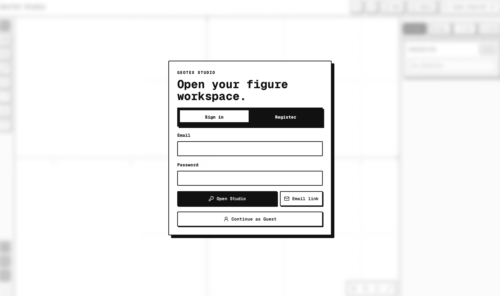
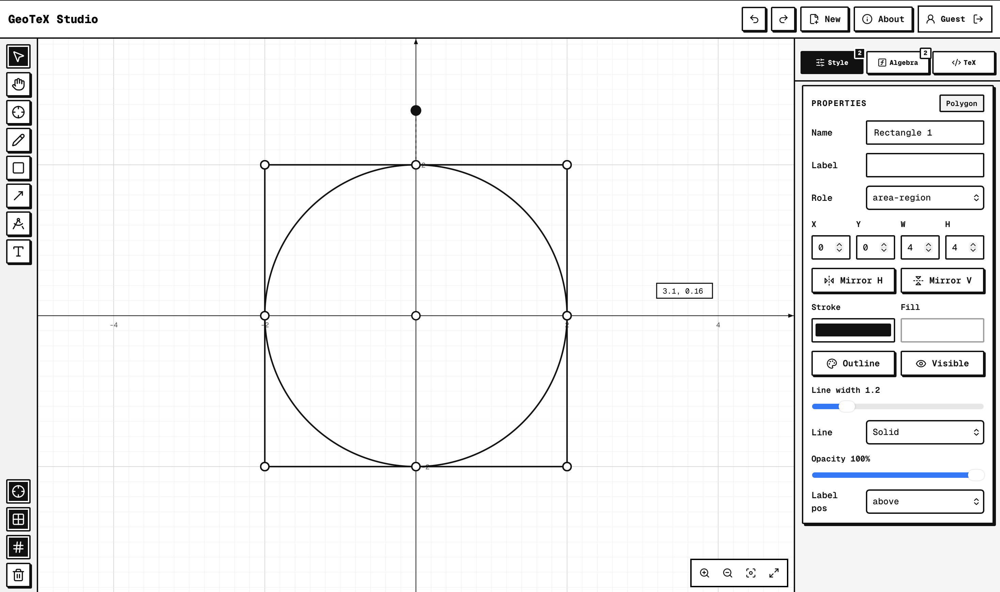

# GeoTeX Studio

**Figures built for TeX.**

Web-based academic figure editor for creating, refining, linting, and exporting GeoGebra-style mathematical and physics diagrams into clean LaTeX/TikZ code.

## Preview




## Features

| Category | Capabilities |
|----------|-------------|
| **Canvas** | SVG editor with pan, zoom, marquee selection, drag handles, rotation |
| **Objects** | Point, Segment, Line, Circle, Vector, Angle, Label, Polygon, PenPath, FunctionPlot |
| **Semantic Roles** | main-object, construction-line, force/velocity/acceleration vectors, axes, tangent lines, theorem labels |
| **Tools** | Select, Hand, Point, Pen, Line, Segment, Circle, Rectangle, Triangle, Angle, Vector, Label |
| **Geometry** | Object rotation, translation, snapping, diagram patching |
| **Quick Constructs** | Right triangle, Free body diagram, Vector basis |
| **Function Parser** | Parse `y=x^2`, `Segment(A,B)`, `Circle(O,r)`, `Vector(P,Q)`, vertical lines |
| **TikZ Export** | Named coordinates, reusable styles, cartesian guide toggle, package hints |
| **Auth** | Supabase Auth with segmented control gate |
| **Persistence** | Projects, diagrams, versions, lint history, export history, custom presets |
| **Offline** | Browser-local access without Supabase credentials |

## Object Model

GeoTeX Studio models every figure as a typed diagram with semantic roles, so the editor can drive geometry, styling, linting, and export from the same source of truth.

### Diagram Object Types

```typescript
type DiagramObjectType =
  | "Point"
  | "Segment"
  | "Line"
  | "Circle"
  | "Vector"
  | "Angle"
  | "Label"
  | "FunctionPlot"
  | "Polygon"
  | "PenPath";
```

### Semantic Roles

```typescript
type SemanticRole =
  | "main-object"
  | "construction-line"
  | "force-vector"
  | "velocity-vector"
  | "acceleration-vector"
  | "electric-field-vector"
  | "theorem-label"
  | "auxiliary-point"
  | "function-curve"
  | "area-region"
  | "axis"
  | "tangent-line";
```

### Diagram Model

```typescript
interface DiagramModel {
  id: string;
  name: string;
  diagramType: "geometry" | "physics" | "calculus" | "custom";
  objects: DiagramObject[];
  viewport: DiagramViewport;
  gridVisible: boolean;
}
```

This structure keeps the editor focused on three things: what the object is, what role it plays, and how the full diagram should render.

## Quick Start

```bash
npm install
npm run dev
```

## Environment Variables

```env
NEXT_PUBLIC_SUPABASE_URL=
NEXT_PUBLIC_SUPABASE_ANON_KEY=
```

Without Supabase credentials, the app works with browser-local storage.

## Database Schema

Tables: `profiles`, `projects`, `diagrams`, `diagram_versions`, `style_presets`, `lint_runs`, `export_history`

Run migration:
```bash
supabase db push
```

## Tech Stack

- **Framework**: Next.js 16, React 19
- **Styling**: Tailwind CSS v4
- **Database**: Supabase (PostgreSQL + Auth)
- **Math**: KaTeX
- **Icons**: Lucide React
- **Testing**: Vitest

## Development

```bash
npm run dev      # Start dev server
npm run lint     # Lint code
npm run test     # Run tests
npm run build    # Production build
```
